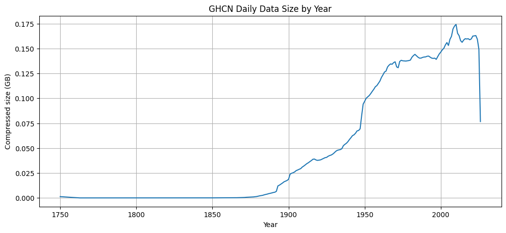
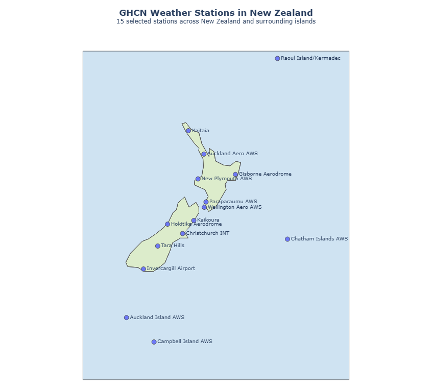
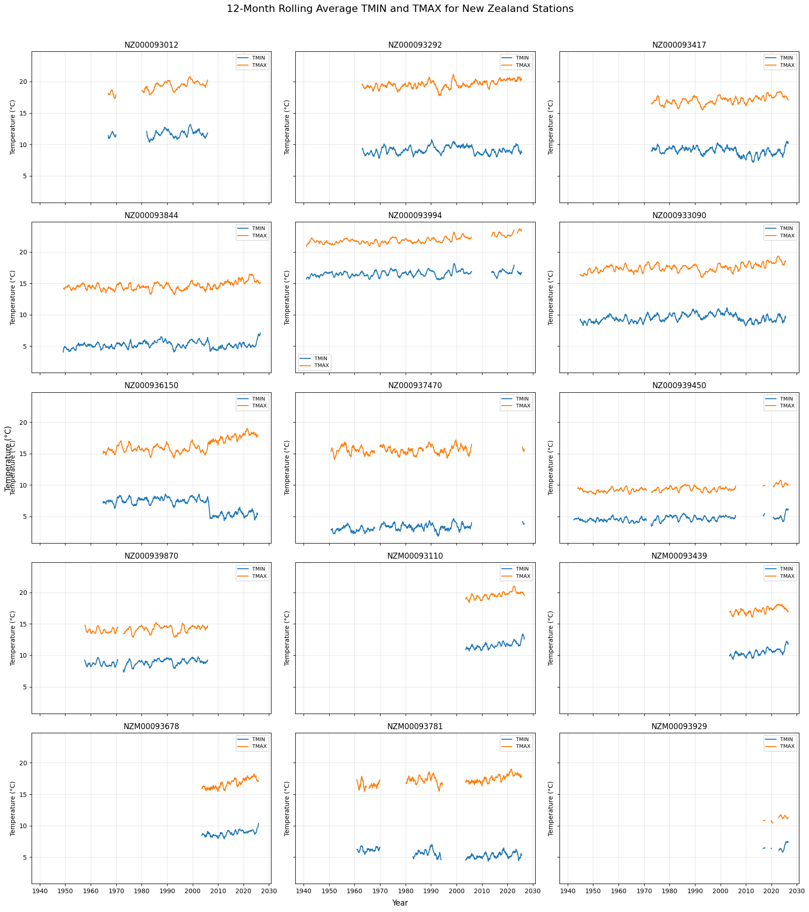
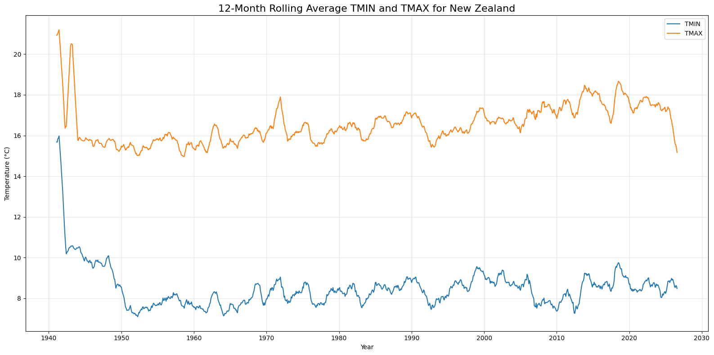
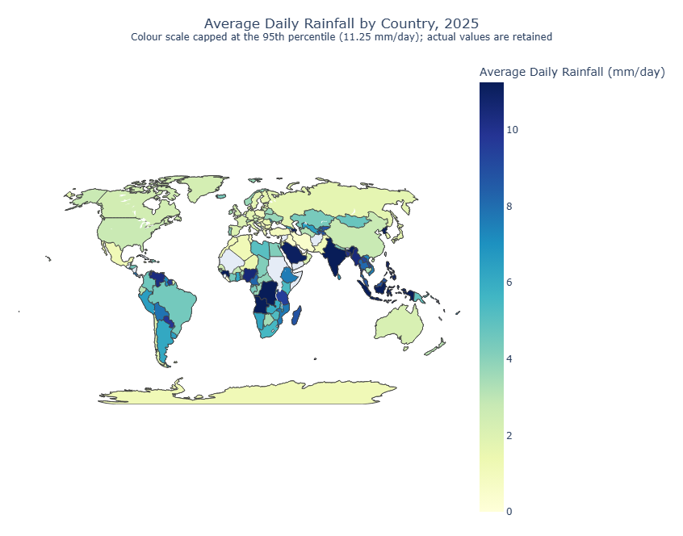

# GHCN Data Analysis using Spark


---

## Background

This assignment uses the **Global Historical Climatology Network – Daily (GHCN-Daily)** dataset to build a distributed data pipeline in Spark. GHCN-Daily is a collection of daily land-surface climate summaries maintained by NOAA, assembled from more than twenty independent sources that have each passed quality-assurance review. It reaches back over 250 years and covers more than 100,000 stations across roughly 200 countries and territories.

The data comes in two parts. The **daily** climate summaries are comma-separated files, one per year, where each row records one observation for one station, on one day, for one element — maximum and minimum temperature, precipitation, snowfall, snow depth and many others — so a single station-day usually spans several rows. Supporting these are four fixed-width **metadata** tables: **stations** (coordinates, elevation, country and state codes, network flags), **countries** and **states** (codes and names), and **inventory** (which elements each station recorded, and the first and last year for each).

The objective was to understand how the data is structured, join the metadata into a single enriched station table, answer specific questions about the stations and their observations, and produce time-series and geospatial visualisations. Spark is the right tool because `daily` is roughly **13 GB compressed** and **3.19 billion rows** — far beyond what one machine can hold. Spark expresses the work as lazy transformations executed in parallel across partitions, so only small aggregated results return to the driver.

Across the three sections I built a reusable enriched station table saved as partitioned Parquet, established that only 63 of 132,501 stations never appear in `daily`, computed pairwise distances between all New Zealand stations, counted observations for the five core elements across the whole dataset, and produced three visualisations. The most useful thing I learned was a habit rather than a number: reduce the data before joining it, and check whether an extreme value is real weather or just a country with one observation. All work ran against Azure Blob Storage over `wasbs://`, reading from `campus-data` and writing outputs to my own `campus-user/ama778` container.

---

## Processing

### Q1 — Structure, compression and size of the data

I explored the directory using `hdfs` commands only, without loading anything into Spark. The structure is shallow: a single `daily/` sub-directory holding one gzip-compressed CSV per year, alongside four uncompressed fixed-width text files.

```
ghcnd/
├── daily/                    265 files, 13.1 G
│   ├── 1750.csv.gz
│   ├── 1763.csv.gz  ...  (gzip-compressed, one file per year)
│   └── 2026.csv.gz
├── ghcnd-stations.txt        11,395,086 B   (fixed-width, uncompressed)
├── ghcnd-inventory.txt       35,991,182 B   (fixed-width, uncompressed)
├── ghcnd-countries.txt            3,659 B   (fixed-width, uncompressed)
└── ghcnd-states.txt               1,086 B   (fixed-width, uncompressed)
```
**Figure 1.** Directory tree of the `ghcnd` dataset in cloud storage, from `hdfs dfs -ls` and `-count`.

**(a) How is the data structured, and is any of it compressed?** The daily summaries are **gzip-compressed CSV** (`.csv.gz`), one file per year; the four metadata tables are **uncompressed fixed-width text**. This matters twice over: gzip is not splittable, so Spark reads each yearly file with a single task and parallelism is bounded by the 265 files rather than by block count; and because the metadata is fixed-width rather than delimited, it cannot be read with `spark.read.csv` and must be parsed by character position.

**(b) How many years, and how does the size change?** `daily` contains **265 distinct years spanning 1750 to 2026**, with a twelve-year gap: **1751–1762 are missing** entirely. Compressed size per year grows dramatically — the eighteenth-century files are a few kilobytes, the data reaches megabytes by the 1890s, tens of megabytes by the 1910s, and roughly 150–175 MB per year through the 2010s and 2020s. The 2026 file is smaller (≈ 82 MB) because it is a partial year.



**Figure 2.** Compressed size of each year of `daily`. Size is negligible before about 1870, climbs steeply from 1890, jumps sharply around 1948, and plateaus near 0.16 GB per year after 2000. The final drop is the partial 2026 file.

The curve reflects growth of the observing network rather than any change in climate — more stations, over more days, recording more elements — with the step around 1948 marking a large expansion in contributing stations.

**(c) Total size, and how much of it is `daily`?** The whole `ghcnd` directory is **13.19 GB**, of which `daily` is **14,116,195,511 bytes (13.15 GiB) — 99.67%**. The four metadata tables together account for under 0.35%.

**Estimating the uncompressed size.** I decompressed a representative recent year (2025) by streaming it through `gzip -dc | wc -c` rather than materialising it. That file expands from **160,283,428 to 1,261,472,066 bytes**, a **compression ratio of 7.87×**, giving an estimated uncompressed `daily` of **≈ 111.1 GB (103.5 GiB)**. Using a recent year is deliberate, since the last few decades dominate the total volume. Older files are sparser and may compress differently, so this is an estimate — but it makes the key point that the working dataset is roughly **eight times larger than its footprint on disk**, and that is what must move through memory and across the network during a scan.

**Table 1. Dataset sizes and row counts.**

| Dataset | Format | Size on disk | Rows | Share of total |
|---|---|---|---|---|
| daily (compressed) | gzip CSV, 265 files | 14,116,195,511 B ≈ **13.15 GiB** | **3,190,506,382** | **99.67 %** |
| daily (uncompressed, estimated) | CSV | ≈ 111.1 GB (103.5 GiB), 7.87× ratio | 3,190,506,382 | — |
| inventory | fixed-width text | 35,991,182 B ≈ 34.3 MB | 782,417 | 0.254 % |
| stations | fixed-width text | 11,395,086 B ≈ 10.9 MB | 132,501 | 0.080 % |
| countries | fixed-width text | 3,659 B | 219 | 0.00003 % |
| states | fixed-width text | 1,086 B | 74 | 0.00001 % |
| **Total** | | **13.19 GB** | | 100 % |

Table 1 drives every later design decision: `stations` is about **1,240 times smaller** than `daily`, so anything that can be pushed onto the small side of a join, or broadcast, should be.

### Q2 — Loading the data and defining schemas

**(a)–(b) Loading the metadata.** Because the metadata is fixed-width, I loaded each file with `spark.read.text` (a single `value` column) and extracted fields with `substring` using the documented character ranges, then cast numeric columns and trimmed the text ones. Whitespace matters: null fields in fixed-width files are blanks, not empty strings, so `trim` is needed before any comparison or join — otherwise `"NZ "` will not match `"NZ"`.

**Answer — rows in each metadata table:** stations **132,501**, countries **219**, states **74**, inventory **782,417**.

**(c) Defining a schema for `daily`.** I defined an explicit `StructType` with `ID`, `DATE`, `ELEMENT`, `VALUE`, the three flags and `OBSERVATION_TIME`, initially typing `DATE` as `DateType`.

**(d) What went wrong, and what types I ended up using.** Declaring `DATE` as `DateType` and reading the 2026 file produced **every `DATE` value as NULL**. Spark accepted the schema without error, but its CSV reader would not parse the compact `YYYYMMDD` form. The lesson: *an accepted schema is not the same as parsed data* — without inspecting the output I would have silently lost the entire date column.

The fix was to load `DATE` as `StringType` and convert it with `to_date(col("DATE"), "yyyyMMdd")`, stating the source format explicitly. Final types: `ID`, `ELEMENT` and the three flags as **string**; `VALUE` as **double**; `DATE` read as **string then cast to date**; `OBSERVATION_TIME` kept as **string**, since it is an `HHMM` clock reading with no arithmetic meaning and an integer would strip the leading zero from times like `0630`.

**(e) Rows in all of `daily`, and does memory matter?**

**Answer:** `daily` contains **3,190,506,382 rows** (~3.19 billion); the most recent year, 2026, contains **17,988,944 rows**.

Counting 3.19 billion rows with 2 executors and 1 core each is slow, but does not require the data to fit in memory: Spark reads partition by partition, each executor computes a partial count, and one integer returns to the driver. Executor memory still matters, because each executor must hold the partitions and intermediate state it is working on, and shuffle-heavy operations (joins, `distinct`, `groupBy`) are where insufficient memory causes spilling. This is why `collect()` or `cache()` on `daily` would be inappropriate — both materialise the whole dataset rather than stream it.

### Q3 — Building the enriched stations table

I extracted the two-character **country code** from the first two characters of each station ID with `withColumn("COUNTRY_CODE", substring(col("ID"), 1, 2))`, then LEFT JOINed to `countries` on that code and to `states` on the state field. Both are LEFT joins so that no station is dropped when metadata is missing — the row count stays at 132,501 throughout, which I checked after each join.

**(c) Which countries actually have stations with state codes?**

**Answer: 16 countries.** Filtering the enriched table to a non-empty `STATE` and taking the distinct country names gives: United States, Canada, American Samoa, Guam, Northern Mariana Islands, Johnston Atoll, Palmyra Atoll, Puerto Rico, Virgin Islands, Wake Island, Midway Islands, Marshall Islands, Palau, Federated States of Micronesia, Bahamas, and **Russia**.

Russia and the Bahamas are a genuine surprise: the GHCN state field is documented as a US/Canada construct, so these are cases where it has been populated outside its intended scope — a reminder that a column's documented meaning and its actual contents do not always agree.

**(d) Inventory summary.** I aggregated `inventory` with `groupBy("ID")`, using `collect_set("ELEMENT")` for the element set per station and `min(FIRSTYEAR)` / `max(LASTYEAR)` for the active span. `collect_set` is the key convenience — holding the elements as an array column turns the later questions into simple array operations (`array_intersect`, `array_contains`, `size`) rather than repeated joins or pivots.

**Answers:**
- **Active in 2026 based on `inventory` alone (LAST_YEAR ≥ 2026): 37,422 stations.**
- **Stations collecting all five core elements: 20,505.**
- **Stations collecting only precipitation and nothing else: 16,189.**

The precipitation-only figure is about 12% of all stations. The brief notes that around half report precipitation only; the discrepancy arises because "only PRCP and nothing else" is a far stricter test than "reports precipitation" — many stations record precipitation plus snowfall and snow depth without temperature. A data-quality check worth recording: `inventory` covers **132,437** stations, so **64 have no inventory record whatsoever**, while **0 inventory records refer to an unknown station**. I kept those 64, since a station present in the metadata but absent from the inventory is a finding, not noise.

**(e) The enriched table and how it was stored.** The final LEFT JOIN of the station/country/state table onto the inventory summary produced **132,501 rows and 18 columns**, exactly as expected from a left join.

**Table 2. Structure of the final enriched `stations` table (`stations_final`).**

| Column | Type | Description |
|---|---|---|
| ID | string | 11-character GHCN station identifier |
| LATITUDE | double | Latitude in decimal degrees (negative = Southern Hemisphere) |
| LONGITUDE | double | Longitude in decimal degrees (negative = west of Greenwich) |
| ELEVATION | double | Station elevation in metres |
| STATE | string | Two-character state/territory code, blank for most countries |
| NAME | string | Human-readable station name |
| GSN_FLAG | string | `GSN` if the station is in the GCOS Surface Network |
| HCN_CRN_FLAG | string | `HCN` or `CRN` for the US Historical Climatology / Climate Reference Networks |
| WMO_ID | string | Five-digit WMO identifier where one exists |
| COUNTRY_CODE | string | Two-character country code taken from characters 1–2 of `ID` |
| COUNTRY_NAME | string | Country name joined from `countries` |
| STATE_NAME | string | State name joined from `states`, null where no state code |
| ELEMENTS | array\<string\> | Set of every element the station has recorded (`collect_set`) |
| FIRST_YEAR | int | Earliest year any element was recorded (`min(FIRSTYEAR)`) |
| LAST_YEAR | int | Latest year any element was recorded (`max(LASTYEAR)`) |
| ACTIVE_2026 | boolean | True when `LAST_YEAR >= 2026` |
| CORE_ELEMENT_COUNT | int | How many of the five core elements the station recorded (0–5) |
| OTHER_ELEMENT_COUNT | int | Count of non-core elements recorded |

**Storage format and partitioning.** I saved this as **Parquet**, partitioned by `COUNTRY_CODE`, after repartitioning to 3 Spark partitions. Parquet beats CSV or CSV.gz here on three counts: it is **columnar**, so later queries needing only `ID` and `COUNTRY_NAME` read just those columns; it is **schema-aware**, so the types and the `ELEMENTS` array survive a write/read cycle, which CSV cannot do without serialising the array to text; and it is **compressed and splittable**, unlike gzip CSV. Partitioning by `COUNTRY_CODE` matches how the table is filtered downstream, letting Spark skip irrelevant files through partition pruning. I used 3 partitions rather than one per country deliberately: with ~219 codes and only 132,501 rows, finer partitioning produces many tiny files whose overhead outweighs the parallelism gained. Reading the Parquet back confirmed **132,501 rows with the schema preserved**.

### Q4 — Checking for missing stations in `daily`

**(a) How expensive would a full join be, and is there a better way?** Joining all of `daily` to `stations` directly means scanning and parsing 3.19 billion rows and shuffling them by station ID so matching keys meet on the same executor — enormous network I/O that would very likely spill to disk. The physical plan for the naive approach confirmed this, showing a **SortMergeJoin** with a full hash-partitioning exchange on both sides.

The insight is that the question — *which stations never appear in `daily`?* — needs no column from `daily` except `ID`. So: project `daily` to `ID`, **broadcast the small 132,501-row station set** and use a **LEFT SEMI JOIN** to keep only daily IDs belonging to a known station, deduplicate that much smaller result, then **LEFT ANTI JOIN** `stations` against it. The plan confirmed a **BroadcastHashJoin … LeftSemi, BuildRight**: the small table is broadcast and the 3.19-billion-row side streams past it with no shuffle. When one side of a join is small, broadcasting converts an expensive shuffle join into a local hash lookup. Projecting to one column first matters independently — carrying eight columns through a shuffle costs several times more.

**(b) How many stations in `stations` are not in `daily`?**

**Answer: 63 stations** appear in the metadata but never occur anywhere in `daily`. In the other direction the semi-join matched **all 3,190,506,382 daily rows**, so **0 station IDs in `daily` are missing from `stations`** — referential integrity from daily to the metadata is perfect.

Three counts are easy to confuse: **64** stations lack an *inventory* record (Q3), **63** never appear in *daily* (Q4), and **93,823** are absent from the 2026 file alone — the last meaning only that most stations were not reporting that year.

---

## Analysis

### Q1 — How many stations, and where are they?

All counts below come from the enriched Parquet table, read back from cloud storage.

**Table 3. Station counts.**

| Count | Value | What it represents |
|---|---|---|
| Total stations | **132,501** | Distinct station IDs in the metadata |
| GSN | **991** | GCOS Surface Network (`GSN_FLAG = 'GSN'`) |
| HCN | **1,218** | US Historical Climatology Network |
| CRN | **234** | US Climate Reference Network |
| In more than one network | **15** | GSN *and* (HCN or CRN) |
| Southern Hemisphere | **25,357** | `LATITUDE < 0` |
| US territories, excluding the USA | **442** | Country name marked `[United States]` |
| New Zealand | **15** | Country code `NZ` |

**(a) Networks.** GSN sits in its own column while HCN and CRN share `HCN_CRN_FLAG`, so a station can be in GSN *and* one of the US networks. Counting the overlap explicitly rather than assuming the groups are disjoint gives **15 stations in more than one network**, so summing 991 + 1,218 + 234 would double-count them.

**(b) Southern Hemisphere and US territories.** I defined the Southern Hemisphere as `LATITUDE < 0`; **25,357 stations** qualify, roughly 19% of the total, reflecting how heavily the network is concentrated in North America and Europe.

For US territories I filtered on country names containing `[United States]`. This needed care: one entry in `ghcnd-countries.txt` is **malformed — `Midway Islands [United States}` closes with a curly brace**. Matching only the correct pattern silently dropped Midway's 3 stations and gave 439; matching both bracket forms gives the correct **442 stations across 9 territories**:

| Territory | Stations |
|---|---|
| Puerto Rico | 285 |
| Virgin Islands | 79 |
| Guam | 34 |
| American Samoa | 21 |
| Northern Mariana Islands | 12 |
| Johnston Atoll | 4 |
| Palmyra Atoll | 3 |
| Midway Islands | 3 |
| Wake Island | 1 |
| **Total** | **442** |

Puerto Rico alone accounts for nearly two-thirds of the territorial stations — and this was a useful reminder that string matching against a hand-maintained metadata file must be checked against the actual values.

**(c) Stations per country.** I aggregated station counts by `COUNTRY_NAME` and LEFT JOINed them onto the `countries` table for later use. The join keeps all **219** countries, including those with no stations, which come through as null rather than zero — a distinction that matters in the rainfall map.

**Answer: New Zealand has 15 stations.**

### Q2 — Geographical distance between stations

**Why a spherical calculation is required.** Latitude and longitude are angular coordinates on a curved surface, not Cartesian coordinates on a plane. Treating them as a flat grid ignores the Earth's curvature and assumes a degree of longitude is a constant distance, when it actually shrinks with the cosine of latitude. At New Zealand's ~41°S a degree of longitude is only about 75% of a degree of latitude, so a planar calculation would systematically overstate east–west separation.

I used the **Haversine formula**, which returns the great-circle distance between two points on a sphere: convert the coordinates to radians, compute `a = sin²(Δφ/2) + cos φ₁ · cos φ₂ · sin²(Δλ/2)`, take the central angle `c = 2 · asin(√a)`, and multiply by the Earth's mean radius **R = 6,371 km**. The `cos φ₁ · cos φ₂` term accounts for meridian convergence and the central angle accounts for curvature. Haversine assumes a perfect sphere, ignoring the Earth's ~0.3% equatorial bulge; an ellipsoidal method such as Vincenty is more accurate but iterative and much slower. At this scale — tens to a couple of thousand kilometres — the spherical approximation is well within acceptable accuracy and is the right trade-off inside a UDF. I wrapped the function with `udf(..., DoubleType())` and tested it on a small `CROSS JOIN` subset first.

**(b) Pairwise distances for New Zealand.** A cross join of the 15 stations produces 225 ordered pairs, including self-pairs and each real pair twice. Filtering with `ID_1 < ID_2` keeps each unordered pair once, giving **105 pairs** (15 × 14 / 2), and applying that filter before computing distances more than halves the UDF calls. The result was saved to Parquet and read back to confirm 105 rows.

**Answer: the two closest stations in New Zealand are `NZ000093417` (Paraparaumu AWS) and `NZM00093439` (Wellington Aero AWS), approximately 50.53 km apart.**

That the *minimum* separation across the whole country is 50 km says a great deal about this network: GHCN holds only 15 New Zealand stations, spread very thinly, and these two near Wellington are the only pair that fall close together.



**Figure 3.** The 15 GHCN stations in New Zealand and its outlying islands, plotted with Plotly on a natural earth projection.

The map makes the network's structure clear in a way the coordinate table cannot. Stations run the length of both main islands at roughly one per region, but four sit on remote islands: **Raoul Island/Kermadec** at 29.3°S, the **Chatham Islands** to the east, and **Auckland** and **Campbell Islands** deep in the subantarctic at 50.5°S and 52.6°S. The network spans over 23 degrees of latitude, which is why the per-station temperature series differ so much in level. One wrinkle: Raoul and the Chathams lie **east of the 180° meridian with negative longitudes**, so plotted raw they would appear on the far side of the world. I added 360° to negative longitudes for plotting only, leaving stored coordinates unchanged.

### Q3 — The daily climate summaries in more detail

**(a) Stations active in 2026 according to `daily`.**

**Answer: 38,678 stations** reported at least one observation in the 2026 file.

Compared with the inventory-based figure from Processing Q3 — **37,422** — the two disagree by **1,256 stations**, with `daily` showing *more* active stations than `inventory` implies. `inventory`'s `LASTYEAR` is derived when the inventory is compiled, so it can lag the raw observations: a station that resumed reporting recently may appear in the 2026 daily file while its inventory record still shows an earlier final year. The two sources answer different questions, and where they conflict `daily` is the primary evidence.

**(b) Observations for the five core elements.** I filtered `daily` with `where(col("ELEMENT").isin("PRCP", "SNOW", "SNWD", "TMAX", "TMIN"))` and grouped by element across the **whole** dataset rather than a single year.

**Table 4. Observation counts for the five core elements (all years of `daily`).**

| Element | Description | Observations | Share of the five |
|---|---|---|---|
| **PRCP** | Precipitation | **1,095,438,345** | 39.9 % |
| **TMAX** | Maximum temperature | **466,229,927** | 17.0 % |
| **TMIN** | Minimum temperature | **465,041,338** | 16.9 % |
| **SNOW** | Snowfall | **367,671,806** | 13.4 % |
| **SNWD** | Snow depth | **306,402,150** | 11.2 % |
| **Total** | | **2,700,783,566** | 100 % |

**Answer: PRCP has by far the most observations, at 1,095,438,345 — more than twice as many as any other element.**

This matches the network structure described in the brief: about half of all stations record precipitation only, so PRCP is measured at far more sites than temperature. Two further points stand out. The five core elements make up about **85%** of all 3.19 billion daily rows, leaving the other 139 element types just 15% between them. And **TMAX and TMIN are nearly identical in count**, differing by only 1,188,589 observations (0.25%) — expected, since a station recording one almost always records the other the same day, and it is that near-equality which makes the next question meaningful.

**(c) TMAX observations with no corresponding TMIN.** The efficient approach is a **LEFT ANTI JOIN keyed on `[ID, DATE]`**: take the TMAX rows, anti-join against the TMIN rows on both station and date, and count what survives. An anti-join returns exactly the left rows with no match in a single shuffle. The alternatives are worse — a full outer join materialises both sides then needs filtering, and grouping or pivoting per station-day shuffles far more data. Projecting each side to just `ID` and `DATE` before joining keeps the shuffle small, since `VALUE` and the flags are irrelevant here. Using both keys is essential: joining on `ID` alone would only find stations that never record TMIN at all, not individual unpaired observations.

**Answer: 10,727,375 TMAX observations have no corresponding TMIN observation, contributed by 28,762 unique stations.**

That is about **2.3%** of all 466 million TMAX observations, confirming the two elements are usually reported together. But 28,762 contributing stations is striking: unpaired observations are spread thinly across a large share of the network rather than confined to a few broken sites, pointing to routine intermittent collection gaps.

---

## Visualizations

### Q1 — TMIN and TMAX for New Zealand stations

**(a) Filtering and describing the data.** I parsed `ID`, `DATE`, `ELEMENT` and `VALUE` from the daily files and reduced to New Zealand TMIN/TMAX with a **LEFT SEMI JOIN** against the 15 NZ station IDs — the right tool because it filters `daily` without adding columns, so nothing from the station table travels through the shuffle.

**Table 5. New Zealand TMIN/TMAX coverage.**

| Measure | Value |
|---|---|
| Total TMIN/TMAX observations | **500,840** |
| Years covered | **87** |
| First observation | 8 March 1940 |
| Last observation | 1 August 2026 |
| Expected calendar days in that span | 31,558 |
| Distinct dates with at least one observation | 31,514 |
| **Dates with no observations at all** | **44** |

**Answer: there are 500,840 TMIN and TMAX observations for New Zealand, covering 87 years from 1940 to 2026. There are gaps: on 44 individual dates no New Zealand station reported either element.**

To find the gaps I generated the complete calendar sequence between the first and last observation with `sequence`/`explode`, then anti-joined the observed dates against it — more reliable than differencing counts, because it returns the actual missing dates. The 44 missing days are **not spread evenly**: every one falls between 2006 and 2026, clustered into short runs (eight consecutive days in May 2015, five in March–April 2026), suggesting short data-feed interruptions affecting all stations at once rather than historical sparseness. Note what this measures: dates when the *entire country* reported nothing — individual stations have far more gaps, as the subplots show.

**(b) Per-station time series.** Raw daily values cannot be compared across 15 stations in one figure, so I aggregated to **monthly means per station**, converting raw tenths of a degree to °C. That gave **9,062 station-months across 15 stations**. I pivoted TMIN and TMAX into separate columns and collected the result to the driver — safe, because 9,062 rows is a trivially small aggregate.

*Smoothing.* Monthly averaging removes day-to-day noise but leaves a strong annual cycle dominating the plot. A **12-month rolling mean** with `min_periods=12` cancels that cycle almost exactly, leaving the long-term level and trend visible; a shorter window retains seasonal oscillation, a much longer one flattens real variation.

*Gaps.* `min_periods=12` produces the rolling average only where a full year of data exists, so gaps stay empty. I deliberately **did not interpolate** — filling gaps would imply observations that were never made.

*Alignment.* To make the panels comparable I built a complete monthly timeline of **1,038 months** (March 1940 to August 2026) and reindexed every station onto it, giving a **15 × 1,038 = 15,570-row** frame with `NaN` where data is absent. With `sharex=True, sharey=True` every panel spans identical axes, so any station's level and record length reads directly against another's.



**Figure 4.** Twelve-month rolling average TMIN and TMAX for each of the 15 New Zealand stations, on shared axes.

Record lengths vary enormously: Gisborne and Invercargill run almost the full 87 years, while Auckland, Wellington and Kaikoura begin only in the 2000s and Auckland Island is little more than a fragment. Temperature *level* separates cleanly by latitude — subantarctic and southern stations sit near 5 °C TMIN, northern and Kermadec stations around 15–16 °C — and several show a mild upward drift over recent decades. Two features are artefacts rather than climate: the abrupt step in `NZ000936150` (Hokitika) around 2005, where TMIN drops roughly 2 °C and stays there, which is the signature of a station relocation or instrument change; and the broken segments in `NZM00093781` (Christchurch), where gaps were preserved rather than filled.

**(c) Country-wide series.** For the national figure I changed approach, averaging across all stations each month and applying the same 12-month rolling mean, giving **1,038 monthly values** on a single large axis. Fifteen overlaid series would be unreadable at that size; one national series makes the long-term signal legible and suits a larger figure.



**Figure 5.** Twelve-month rolling average TMIN and TMAX averaged across all New Zealand stations.

From about 1950 onward the national series is stable and shows gentle warming in both TMIN and TMAX, with TMAX rising from roughly 15.5 °C to around 17.5 °C. The **1940–1950 portion should not be read as climate**: only one or two stations were reporting then, so the "national average" is really one station's record and it swings wildly — TMAX spikes above 21 °C and TMIN falls by 8 °C within a couple of years — stabilising only as more stations join. This is a real limitation of averaging over a changing set of stations: the mean reflects *which* stations reported as much as the weather.

### Q2 — Global rainfall

**(a) Average daily rainfall by country and year.** Starting from the full daily dataset — **3,190,161,793 rows** across the 264 files from 1763 to 2026 — I filtered to `ELEMENT = 'PRCP'`, retaining **1,095,197,420 observations**, joined each station to its country through a small lookup, extracted the year, and grouped by year and country taking the mean of `VALUE`. This produced **17,789 country-year records**, saved to Parquet. (I excluded the 1750 file here for its known data-quality problems, which is why this count sits just below the 3,190,506,382 in Processing Q2.)

What this average means matters for everything that follows: it is the **mean of reported PRCP observations** for a country-year, not the mean of one national value per calendar day. A country with 40 stations reporting daily contributes tens of thousands of observations; one with a single station reporting once contributes one. The measure is weighted by reporting effort, which causes the outliers below.

**Table 6. Descriptive statistics for average daily rainfall by country-year (all years).**

| Statistic | Value (mm/day) |
|---|---|
| Count (country-years) | 17,789 |
| Mean | 4.20 |
| Standard deviation | 8.42 |
| Minimum | 0.00 |
| Maximum | **436.10** |

Raw GHCN precipitation values are in **tenths of a millimetre**, so all figures here are divided by 10. A mean of 4.2 mm/day is plausible for a global average of reported rainfall, while a standard deviation twice the mean and a maximum roughly 100 times it signal a severely right-skewed distribution.

**Which country has the highest average rainfall in a single year, and is it sensible?**

**Answer: Equatorial Guinea in 2000, at 436.1 mm/day. This result is not sensible.**

I investigated rather than simply reporting it. Equatorial Guinea has two stations, and in 2000 the country's *entire* precipitation record was a **single observation**: station `EKM00064810` (Malabo) on 22 June 2000, recording 4,361 tenths of a mm. One exceptionally wet day treated as a whole-year average produces a meaningless figure — 436 mm in a day is extreme but possible in the tropics; as an *annual average* it is absurd. The other top country-years follow the same pattern: Dominican Republic 1975, Laos 1974, Belize 1978, all small 1970s samples. The general lesson is that these extremes are not bad measurements but **statistically unstable estimates from tiny samples**, so the number of contributing observations must be checked before any country-year value is trusted.

**(b) The 2025 choropleth.** For 2025 there are **172 country-year records**, with mean **5.28 mm/day**, median 3.83 and maximum **54.0 mm/day**.

*Outliers.* The 2025 maximum is **Azerbaijan at 54.0 mm/day**, again a sparse-sample artefact: the country reported only **three** precipitation observations all year, one of them 122 mm. Counting observations per country shows how uneven coverage is — **5 countries have 3 or fewer, 9 have 10 or fewer, and 17 have 30 or fewer**:

| Country | 2025 PRCP observations |
|---|---|
| Liberia | 1 |
| Gambia, The | 2 |
| Lebanon | 2 |
| Angola | 3 |
| Azerbaijan | 3 |
| Zambia | 4 |
| Kazakhstan | 4 |
| Cape Verde | 9 |
| Korea, South | 10 |

The distribution is heavily skewed: 25th percentile 1.89, median 3.83, 75th 6.78, 90th 10.04, 95th 11.25, and 99th 54.00 mm/day. The jump from the 95th to the 99th percentile is entirely Azerbaijan.

*How I handled outliers.* Rather than deleting them I **capped the colour scale at the 95th percentile (11.25 mm/day)**, keeping the true values in the data and the hover text. Deleting a country for having an extreme value would discard real information and hide a coverage problem the reader should see; leaving the scale uncapped would compress 169 countries into the bottom fifth of the colour range to accommodate one. Capping is a presentation decision, annotated in the subtitle, and reversible.

*Country matching.* Plotly's choropleth keys on ISO-3 codes, and GHCN names do not match ISO names directly (`Burma`, `Korea, North`, `Cote D'Ivoire`, territories written as `Mayotte [France]`). I built an explicit name→ISO-3 mapping and verified it: **all 172 records matched, 0 unmatched**. One genuine ambiguity emerged — **Svalbard and Jan Mayen are separate GHCN entries sharing the single code `SJM`** — collapsing 172 records to 171 unique codes. A country-level choropleth cannot show two values for one shape, and choosing one arbitrarily would mislead, so I **excluded both from the map**, leaving **170 countries plotted**; this affects only the visualisation.

*Countries matched but with no observations.* **47 countries and territories have stations but reported no precipitation at all in 2025** — among them Afghanistan, Belgium, Croatia, Cuba, Guatemala, Kuwait, Mali, Panama, Sudan, Syria and Uganda. These render as **missing (uncoloured)**, not zero. The distinction matters: colouring them zero would show Belgium and Sudan as the driest places on Earth when nothing was reported. Genuine low values — Liberia and Lebanon at 0.0, the Gulf states at a fraction of a mm/day — appear at the pale end because they *were* observed.

*Projection and colour scale.* I used the **natural earth** projection. A choropleth compares areas, so a conformal projection like Mercator is a poor choice, inflating high latitudes until Greenland and Russia dominate; natural earth keeps area distortion modest and shapes recognisable. For colour I used **`YlGnBu`**, a **sequential** scale from pale yellow to dark blue. Rainfall is a single-ended ordered quantity with no meaningful midpoint, so a sequential scale is correct — a diverging scale would imply a centre that does not exist, and a categorical palette would destroy the ordering. Yellow-to-blue also reads intuitively as dry-to-wet.



**Figure 6.** Average daily rainfall by country for 2025, natural earth projection, sequential `YlGnBu` scale capped at the 95th percentile.

**How rainfall is distributed, and what stands out.** The broad pattern is climatologically sensible. The wettest band runs through the **equatorial tropics** — Central Africa (Congo, Guinea, Cameroon), South and Southeast Asia (India, Bangladesh, Burma, Indonesia, Malaysia, the Philippines) and northern South America — matching the Intertropical Convergence Zone. The driest areas are the **arid subtropics**: the Sahara, the Arabian Peninsula, Iran and central Asia, plus inland Australia and much of western North America. Mid-latitude Europe, Canada and Russia sit in the low-to-middle range.

Three anomalies are worth naming. **Azerbaijan and Angola** appear as dark as the wettest tropical countries purely because of their three-observation samples. **Antarctica is coloured**, which looks odd on a rainfall map, but GHCN does have Antarctic stations and the value is genuine reported precipitation. And the **47 blank countries** — a conspicuous gap across parts of Africa, Central America and the Middle East — reflect missing 2025 reporting, not aridity. The map is a fair picture of *where rainfall was reported and how much*, but uneven coverage means it is not a precise climate comparison.

---

## Conclusions

Working through GHCN-Daily end to end gave me a concrete sense of what changes when a dataset stops fitting on one machine. The data is now well characterised: `daily` is 13.15 GiB compressed across 265 yearly files, expanding roughly 7.9× to an estimated 111 GB and 3.19 billion rows, and accounting for 99.67% of the total; there are 132,501 stations, of which 20,505 record all five core elements and 16,189 record precipitation only; 63 never appear in `daily`; the two closest New Zealand stations are 50.5 km apart; precipitation dominates with 1.095 billion observations; and 2.3% of TMAX observations have no matching TMIN.

Three techniques did most of the work. **Reducing before joining** — projecting `daily` to one column and deduplicating — turned an intractable join into a cheap one. **Broadcasting the small side** replaced a shuffle of 3.19 billion rows with a local hash lookup, as the physical plans confirmed. And **aggregating before collecting** meant every visualisation was driven by a few thousand rows on the driver rather than the raw data.

The judgement calls mattered just as much. Declaring `DATE` as a date type silently produced nulls, teaching me to verify parsed output rather than trust an accepted schema. A malformed closing brace in the countries file quietly cost three stations until I checked the raw values. And the rainfall work was largely an exercise in scepticism: the headline "wettest country-year on Earth" rested on a single observation, and the honest answer was to explain why the number is meaningless rather than report it. Distinguishing *no observation* from *zero* on the choropleth is the same instinct applied to a map. If I continued, I would control for station composition in the national temperature series using anomalies relative to each station's own baseline, and attach an observation count to every country-year so sparse estimates can be filtered rather than caveated in prose.

---

## References

- NOAA National Centers for Environmental Information. *Global Historical Climatology Network – Daily (GHCN-Daily)*. https://www.ncei.noaa.gov/products/land-based-station/global-historical-climatology-network-daily
- Menne, M. J., Durre, I., Vose, R. S., Gleason, B. E., & Houston, T. G. (2012). An overview of the Global Historical Climatology Network-Daily database. *Journal of Atmospheric and Oceanic Technology*, 29(7), 897–910.
- NOAA NCEI. *GHCN-Daily README* — Section III element codes, units, and measurement/quality/source flags.
- Sinnott, R. W. (1984). Virtues of the Haversine. *Sky and Telescope*, 68(2), 159. — great-circle distance formula used in Analysis Q2.
- Apache Software Foundation. *Spark SQL, DataFrames and Datasets Guide*, Spark 3.3.5. https://spark.apache.org/docs/latest/sql-programming-guide.html
- Apache Software Foundation. *Apache Parquet documentation*. https://parquet.apache.org/docs/
- Plotly Technologies Inc. *Plotly Express: Choropleth maps* and *Scatter plots on maps*. https://plotly.com/python/choropleth-maps/ · https://plotly.com/python/scatter-plots-on-maps/
- Brewer, C. A., & Harrower, M. *ColorBrewer 2.0: Colour advice for cartography*. https://colorbrewer2.org — basis for the sequential `YlGnBu` scale.
- The Matplotlib Development Team. *Matplotlib documentation*. https://matplotlib.org/stable/index.html

*Use of generative AI is acknowledged separately in accordance with the assignment instructions, describing the tools used and how they were used.*
